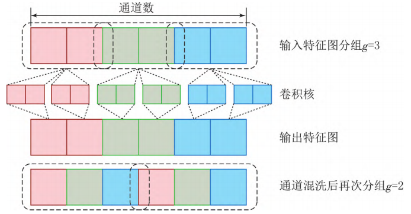
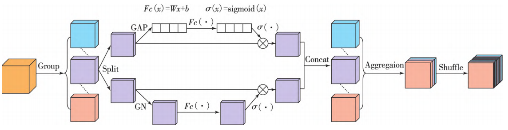
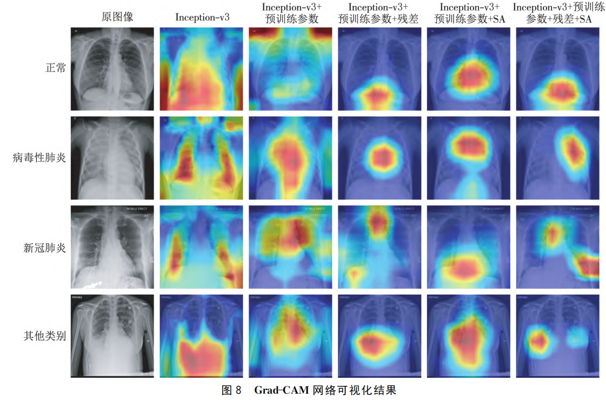

## Pneumonia detection method based on improved Inception-v3 network
<a href="https://link.cnki.net/doi/10.16163/j.cnki.dslkxb202303310001">10.16163/j.cnki.dslkxb202303310001</a>

An Improved InceptionV3 Network for Pneumonia Detection, incorporating a Spatial Attention (SA) module to introduce both spatial and channel attention. This approach utilizes grouped convolutions and channel shuffling to reduce the number of network parameters while minimizing the negative impact on network performance.

  
  

Ablation experiments were conducted using public datasets to validate the model's performance. The experiments demonstrated that the model possesses strong classification capabilities, accurately identifying four different categories. Additionally, Grad-CAM was used to visualize the key areas of focus within the network.

  
  

